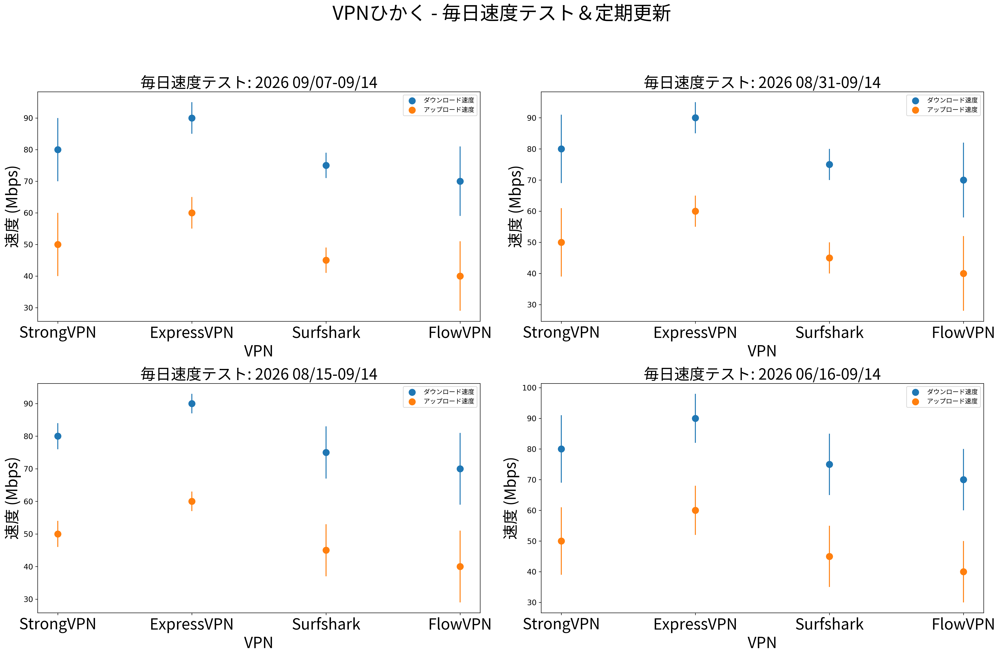

# 海外からTVer・ABEMAが見られない時のVPN設定と確認手順

海外旅行、留学、駐在中にTVerやABEMAを開くと、地域制限のメッセージが表示されたり、トップページは開くのに動画だけ再生できなかったりします。原因は「VPNが遅い」だけではありません。

日本のIPアドレス、ブラウザのCookie、アプリストア地域、端末の位置情報、アカウントや決済地域が組み合わさって判定されるため、順番に切り分けることが重要です。

> **最短手順：** 日本サーバーへ接続 → IPが日本になったか確認 → シークレットウィンドウで公式サイトを開く → 動画を1本再生 → 失敗したらCookieと位置情報を確認します。いきなり長期契約せず、実際に使う端末で返金期間中に試してください。

## TVer・ABEMA・日本動画サービスの違い

| サービス | 最初に確認するもの | よくある失敗 | 次に試すこと |
|---|---|---|---|
| TVer | 日本IP、Cookie、ブラウザ | ページは開くが再生できない | シークレットウィンドウ、別の日本サーバー |
| ABEMA | 日本IP、アプリ/ブラウザ、アカウント | 地域外メッセージ、広告後に停止 | 位置情報権限、Cookie、アプリ地域 |
| U-NEXT・Hulu Japan | 日本IP、契約・決済地域 | ログインまたは作品再生で停止 | アカウント条件と利用規約を確認 |
| 日本版Netflix | IP、Cookie、アカウントのカタログ | 海外カタログのまま | サーバー変更、アプリ再起動 |
| NHK系配信 | IP、アカウント、対象番組の権利 | 番組ごとに利用可否が異なる | 公式の海外提供条件を確認 |

VPNを使っても、作品の配信権、契約条件、アカウント地域まで変更できるとは限りません。各サービスの利用規約と滞在国のルールを確認してください。

## 最初に試すVPNの順番

このサイトでは価格だけでなく、実際の端末で失敗を再現できるか、返金や試用期間内に判断できるかを重視します。

| 順番 | VPN | 向いている人 | 購入後すぐ確認すること |
|---:|---|---|---|
| 1 | [StrongVPN](https://strongvpn.com/jp/?tr_aid=60d96b5810e50&chan=w_github_jp&data1=jp-home&data2=hero) | 1年以内の費用を抑えて、日本動画と日常利用を試したい | 日本サーバー、Windows/スマホ、TVer・ABEMAの実再生 |
| 2 | [ExpressVPN](https://www.expressvpn.com/jp/top/country/japan-vpn?xvcid=yKMwqFWTfxyKWsB3AWwmhXdXUkpXYnRgxWVX3Q0&shareid=&irclickid=yKMwqFWTfxyKWsB3AWwmhXdXUkpXYnRgxWVX3Q0&irgwc=1&afsrc=1) | 料金よりアプリの操作性やサポートを重視 | 日本ロケーション、TV端末、更新価格 |
| 3 | [Surfshark](https://get.surfshark.net/aff_c?offer_id=323&aff_id=5585&source=w_github&aff_sub=jp) | 家族や複数端末で同時に使いたい | 長期契約の総額、テレビアプリ、同時接続 |
| 4 | [FlowVPN](https://www.flowvpx.com/sign-up/?locale=ja-jp&special=FREETRIAL&r=35-890485.w_github) | まず短期間だけ相性を確認したい | 3日試用の終了条件、日本サーバー、解約方法 |

アフィリエイト開示：上記リンク経由で契約されると、当サイトが紹介料を受け取る場合があります。読者の追加負担はありません。だからこそ「必ず見られる」とは書かず、購入後に確認すべき条件を明記しています。

## 10分でできるブラウザ確認

1. VPNを切った状態で現在のIP地域を記録する。
2. VPNアプリで日本サーバーに接続する。
3. IP確認サイトで国が日本になっているか確認する。
4. ChromeやEdgeのシークレットウィンドウを開く。
5. TVerまたはABEMAの公式サイトへ直接アクセスする。
6. トップページではなく、実際の動画を10分以上再生する。
7. 失敗したら別の日本サーバーへ変更し、ブラウザを完全に閉じて再試行する。

## スマホアプリで失敗する時

ブラウザでは見られるのにアプリだけ失敗する場合、VPNを変える前に次を確認します。

- iPhone/Androidの位置情報権限を必要以上に許可していないか。
- App StoreまたはGoogle Playの国設定が日本以外になっていないか。
- アプリがVPN接続前の地域情報をキャッシュしていないか。
- モバイル回線とWi-Fiが自動で切り替わっていないか。
- 日付・時刻・タイムゾーンが大きくずれていないか。

アプリストア地域を変更すると、残高や既存サブスクリプションに影響する場合があります。変更前にAppleまたはGoogleの公式条件を確認してください。

## Fire TV・Apple TV・Android TV

テレビ端末では「VPNアプリがあるか」だけでなく、動画アプリの入手地域とアカウント地域も必要です。まずPCかスマホで再生できることを確認してから、テレビへ進む方が原因を切り分けやすくなります。

1. 同じWi-Fi上のPCで日本サーバーと動画再生を確認する。
2. TV端末に公式VPNアプリがあるか確認する。
3. なければ対応ルーターや共有接続を検討する。
4. TVアプリを完全終了し、VPN接続後に起動する。
5. 画質、音声、字幕、15～30分の連続再生を確認する。

## 速度テストの読み方

動画視聴では最高速度より、夜間の安定性、再接続、エラー率が重要です。下の図は比較ラボが更新している傾向データであり、あなたの国、回線、端末で同じ結果を保証するものではありません。

[総合比較の速度・料金・接続チェックを見る](../#毎日更新のvpn速度テスト)

## エラー別の切り分け

### 地域外メッセージが出る

IPが日本か確認し、Cookieを削除する前にシークレットウィンドウで試します。それでも失敗する場合は別の日本サーバーへ変更します。

### ログインできるが動画だけ再生できない

番組の配信権、アカウント地域、広告ブロッカー、DRM、ブラウザ拡張機能を確認します。VPN接続成功と作品再生成功は別です。

### 途中で止まる・画質が落ちる

近い日本サーバー、別プロトコル、有線LAN、混雑時間外を試します。4Kだけが止まるなら、まず1080pで安定性を確認します。

### どのVPNも失敗する

同じ端末・同じCookie・同じアカウントで試し続けると原因が残ります。ブラウザ、別端末、別ネットワークの順で一つずつ変えてください。

## 結論

海外からTVerやABEMAを見る時は「日本IPになったか」だけで判断せず、Cookie、アプリ地域、アカウント、端末を順番に確認します。費用を抑えて最初に試すならStrongVPN、操作性とサポート重視ならExpressVPN、多数端末ならSurfshark、短期相性確認ならFlowVPNという分け方が明確です。

[VPN比較ラボの総合ページへ戻る](../)
